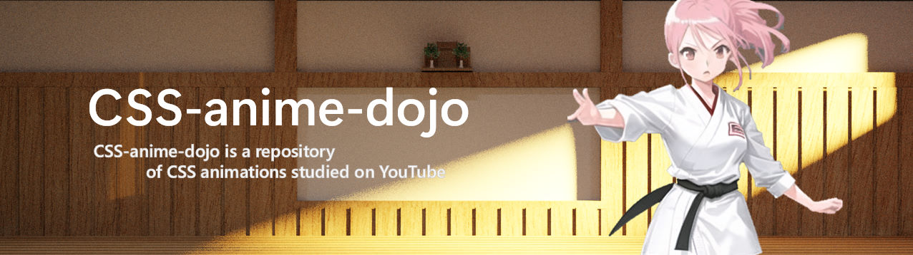

<div></div>

<div align="center">CSS-anime-dojo is a repository of css animations studied on YouTube</div>

---

- [Installation](#installation)
- [Usage](#usage)
- [Test](#test)

# Installation

```bash
$ git clone https://github.com/jinwatanabe/css-anime-dojo.git
$ cd css-anime-dojo
```

# Usage

```bash
# Run realize
$ make dev
```

# Test

```bash
# Run test
$ make test
```
